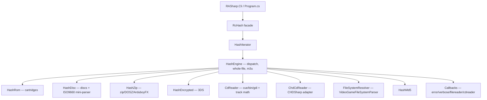

# Architecture overview

RASharp is a **parity-first** port: every algorithm, constant, control-flow
branch and error string is translated 1:1 from the C engine. The ported
vectors and the diff harness are the final arbiters — a mismatch is a bug,
never an accepted difference.

## The source of truth

| Era | Reference | Status |
|---|---|---|
| Part I | `References/rcheevos-40d916d` (rcheevos **12.2.1**, the RAHasher 1.8.3 pin) | ported 1:1, phases 0–8 |
| Part II | `References/rcheevos-12.4.0` (current release) | **single source of truth** — every behavioral question is answered from this tree; sync procedure in [sync-rcheevos](../development/sync-rcheevos.md) |

## Layers

## Module map (C# ↔ C)

| C# file (`RASharp.Core/`) | C source (rcheevos) | Role |
|---|---|---|
| `RcHash.cs` | `include/rc_hash.h` | public facade: `GenerateFromFile` / `GenerateFromBuffer` + init callbacks |
| `ConsoleIds.cs` | `include/rc_consoles.h` + `rc_hash.h` | `RC_CONSOLE_*` constants, `RC_HASH_CDTRACK_*`, `RC_CONSOLE_MAX` |
| `Models/` (8 files) | `rc_hash.h`, `hash.c`, `cdreader.c` | data models: `RcHashIterator`, `ExtHandlerEntry`, `CdromTrack`, `RcHashFilereader`, `RcHashCdreader`, `RcHashEncryptionCallbacks`, `RcHashCallbacks` (Cli: `ConsoleInfo`) |
| `HashIterator.cs` | `hash.c` (iterator + ext-handler table) | `?` iterate API, extension→console mapping |
| `HashEngine.cs` | `hash.c` | dispatch tables, whole-file/buffered hashing, 64 MiB cap, m3u, callbacks plumbing |
| `HashRom.cs` | `hash_rom.c` | cartridge algorithms (incl. `.neo` from 12.4.0) |
| `HashDisc.cs` | `hash_disc.c` | disc algorithms + ISO9660 mini-parser (`rc_cd_find_file_sector`) |
| `CdReader.cs` | `cdreader.c` | default CD reader: cue/gdi/bin, sector math, track selection |
| `ChdCdReader.cs` | `HashCHD.cpp` behavior | CHD track reader on CHDSharp |
| `FileSystemResolver.cs` | — (new) | VideoGameFileSystemParser adapter (alternative ISO9660 backend) |
| `HashZip.cs` | `hash_zip.c` | byte-level zip parsing, DOSZ/DOSC, Arduboy FX |
| `HashEncrypted.cs` | `hash_encrypted.c` | 3DS CIA/NCCH/3DSX/ELF decryption choreography |
| `AesHelper.cs` | `aes.c` call pattern | AES-128 CBC/ECB on `System.Security.Cryptography` |
| `Hash3DS.cs` | `Hash3DS.cpp` behavior | `aes_keys.txt` + `seeddb.bin`, key normalization |
| `HashMd5.cs` | `md5.c` | streaming MD5 with `md5_init/append/final` semantics |
| `Callbacks.cs` | `rc_hash.h` | message/key callback delegates (the structs are in `Models/`) |

## Design invariants

1. **Translate 1:1, never "improve".** If the C has a quirk, the port has the
   quirk — see [known quirks](../reference/known-quirks.md).
2. **One source of truth per behavior.** Every algorithm has exactly one
   C# implementation, verified against vectors and the oracle.
3. **64 MiB cap everywhere it exists in C.** `MAX_BUFFER_SIZE` is applied to
   whole-file, buffered, `.neo`, and disc-file reads exactly like the C.
4. **Byte-identical text.** Error messages, verbose lines, and the usage
   banner match the C byte-for-byte (the parity harness compares raw bytes,
   including `\r\n`).
5. **Origin headers.** Every ported file carries a
   `// Ported from rcheevos (MIT) — src/rhash/<file>.c` header; new
   implementations declare their GPL-reference lineage explicitly.

## Data flow for a single hash

1. `Program.cs` resolves the console (key/`?`/numeric) and calls
   `RcHash.GenerateFromFile`.
2. `HashEngine` builds an `RcHashIterator` (path + filereader + cdreader)
   and dispatches on the console id.
3. The console handler reads via the filereader/cdreader callbacks and
   streams bytes into a `HashMd5`.
4. The 32-char hash is returned; the CLI prints it (`Console.Write`), or an
   error message via the error callback (stderr).

## CLI module map

| C# file (`RASharp.Cli/`) | Reference | Role |
|---|---|---|
| `Program.cs` | `RAHasher.cpp` behavior (GPL, reference only) | arg parsing, console resolution, wildcards, zip preload, output |
| `Consoles.cs` | factual table data from `RAHasher.cpp` | console id/key/group/name metadata (81 entries) |

See the [CLI deep dive](cli.md) for the arg-processing details.
